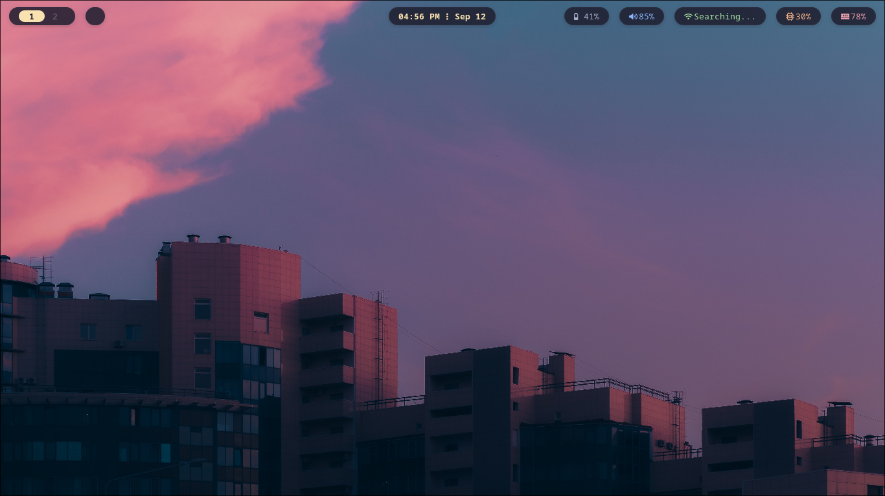
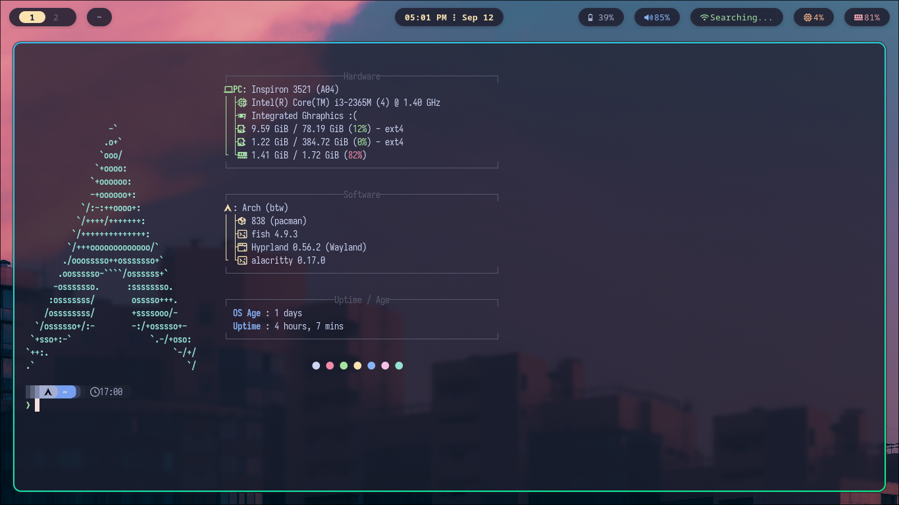

<div align="center">

# ❄️ Aradhy's Dotfiles

*My personal Arch Linux configuration files, optimized for speed, aesthetics, and productivity.*

[](#)
[](#)
[](#)
[](#)

</div>

---

### 🖥️ Overview

My personal desktop setup on **Arch Linux**, built around Hyprland and themed with **Catppuccin**.

The main focus here is how **Wallust** ties the whole desktop together:
* Running `wallust run /path/to/image` takes the colors from your wallpaper and automatically syncs them across Alacritty, the Starship prompt, and Fastfetch.
* If you don't like how a palette turns out, I added a custom `wallust --restore` flag that puts your default configs back instantly.
* Wallpapers rotate once a day via a systemd timer. If you hate the current one, typing `next` in the terminal skips to another. (The auto-rotation pauses if you've manually set a Wallust template so it doesn't overwrite your theme).

---

### ⚙️ System Details

| Component | Choice |
| :--- | :--- |
| **OS** | [Arch Linux](https://archlinux.org/) |
| **Terminal** | [Alacritty](https://github.com/alacritty/alacritty) |
| **Shell** | [Fish Shell](https://fishshell.com/) |
| **Prompt** | [Starship](https://starship.rs/) |
| **Colorscheme** | [Catppuccin](https://github.com/catppuccin/catppuccin) |

---

### 📸 Screenshots




---

## 🚀 Installation

> [!WARNING]
> Before running the script or moving files around, back up anything important inside `~/.config/`.

### Automatic Install:-

Just run:

```bash
bash -c "$(curl -sL https://raw.githubusercontent.com/Aradhy-arch/aradhy-dotfiles/main/install.sh)"
```
OR if you want, you can just run:
```bash
git clone --depth=1 https://github.com/Aradhy-arch/aradhy-dotfiles
cd aradhy-dotfiles && chmod +x install.sh
./install.sh
```
---

### 💬 Telling you random shit before you go manual...

* **Why manual?** If you prefer not to run a bash script blindly, every step is broken down below so you can run the commands yourself.

* **Skipping wallpapers:** The `next` command is an alias to jump to the next background whenever you feel like changing it up.

* **Why no NixOS guide?** These configs are built specifically for an Arch filesystem layout. Porting it to Nix flakes would just fry my brain because I'm just a 13-year-old, hope you like it :D

---

### Manual Install:-
* Before You Install it manually, you need the required packages, and the recommended packages (assuming you use yay), just run this very short command:
```bash
sudo pacman -S --needed fish btop zoxide fzf fastfetch starship eza bat micro neovim qt6-svg qt6-virtualkeyboard qt6-multimedia-ffmpeg hyprland hyprpaper hyprlock swaync cliphist grim slurp waybar rofi hyprpolkitagent hypridle hyprsunset xdg-desktop-portal-hyprland xdg-desktop-portal-gtk qt5-wayland qt6-wayland noto-fonts-cjk noto-fonts-emoji pipewire pipewire-alsa pipewire-pulse pipewire-jack wireplumber bluez bluez-utils blueman wf-recorder brightnessctl alacritty discord spotify-launcher mousepad thunar xarchiver thunar-archive-plugin sddm wl-clip-persist imv mpv cmatrix && yay -S --needed cbonsai pipes.sh helium-browser-bin wallust lavat volumectl peaclock
```
This just Installs Audio, and Bluetooth dependencies along with needed apps. You have to enable the services yourself I ain't gonna tell everything here so just search it up :p

1. **Clone the repo:**
```bash
git clone --depth=1 https://github.com/Aradhy-arch/aradhy-dotfiles
cd aradhy-dotfiles
```

2. **Copy configuration folders into `~/.config` and `~/.local`:**
```bash
cp -r swaync ~/.config
cp -r alacritty ~/.config
cp -r fastfetch ~/.config
cp -r fish ~/.config
cp -r hypr ~/.config
cp -r random_conf_shit ~/.config
cp -r systemd ~/.config
cp -r wallust ~/.config
cp -r waybar ~/.config
cp -r rofi ~/.config
cp -r gtk-3.0 ~/.config
mv peaclock ~/.config/.peaclock
mv ~/.config/random_conf_shit/rofi ~/.local/share
```

3. **Move standalone config files and binaries:**
```bash
cp daily-wall ~/.local
cp starship.catppuccin.toml ~/.config
cp starship.toml ~/.config
sudo mv logind.conf /etc/systemd/logind.conf
```

4. **Apply the SDDM theme:**
```bash
sudo cp -r sddm-astronaut-theme /usr/share/sddm/themes/
sudo mkdir -p /etc/sddm.conf.d
echo -e "[Theme]\nCurrent=sddm-astronaut-theme" | sudo tee /etc/sddm.conf.d/theme.conf > /dev/null
```

5. **Make the scripts executable:**
```bash
chmod +x ~/.config/random_conf_shit/sddmtheme.sh
chmod +x ~/.config/random_conf_shit/usb_formatter.sh
chmod +x ~/.config/wallust/templates/set_bg.sh
chmod +x ~/.config/wallust/set_bg.sh
chmod +x ~/.local/daily-wall
chmod +x ~/.config/hypr/scripts/wifi-menu.sh
chmod +x ~/.config/hypr/scripts/power_menu.sh
chmod +x ~/.config/hypr/scripts/logout_menu.sh
chmod +x ~/.config/hypr/scripts/reboot_menu.sh
chmod +x ~/.config/hypr/scripts/rofi-bluetooth.sh
chmod +x ~/.config/hypr/scripts/screen-record.sh
```
6. **Get Wallpapers:**
```bash
wget -P ~/Pictures/ [https://github.com/Aradhy-arch/aradhy-dotfiles/releases/download/Wallp/Wallpapers.zip](https://github.com/Aradhy-arch/aradhy-dotfiles/releases/download/Wallp/Wallpapers.zip)
unzip ~/Pictures/Wallpapers.zip -d ~/Pictures/
rm ~/Pictures/Wallpapers.zip
```
---

## ⌨️ Keybindings

> [!NOTE]
> **All The Keybindings Can Easily Be Changed In `~/.config/hypr/configs/keybinds.lua`**

### Applications & System
| Keybind | Action |
| :--- | :--- |
| `SUPER + Q` | Open Terminal (Alacritty) |
| `SUPER + W` | Open Browser (Helium) |
| `SUPER + E` | Open File Manager (Thunar) |
| `SUPER + P` | Open Spotify |
| `SUPER + SPACEBAR` | Open App Launcher |
| `SUPER` | Kill Menus |
| `SUPER + N` | Notification Center (Swaync) |
| `SUPER + V` | Open Clipboard Manager |
| `SUPER + SHIFT + V` | Wipe Clipboard |

### Window Management
| Keybind | Action |
| :--- | :--- |
| `SUPER + R` | Close Window |
| `SUPER + F` | Toggle Floating Window |
| `SUPER + J` | Toggle Split Layout |
| `SUPER + U` | Pseudo Window |
| `SUPER + Arrows` | Move Focus (Left/Right/Up/Down) |
| `SUPER + LMB` | Move Window (Hold & Drag) |
| `SUPER + RMB` | Resize Window (Hold & Drag) |

### Workspaces
| Keybind | Action |
| :--- | :--- |
| `SUPER + 1-0` | Go to Workspace 1-10 |
| `SUPER + ALT + 1-0` | Move Window to Workspace 1-10 |
| `SUPER + Scroll` | Switch Workspaces |
| `SUPER + S` | Toggle Special Workspace ("Magic") |
| `SUPER + SHIFT + S` | Move Window to Special Workspace |

### Utilities, Power & Media
| Keybind | Action |
| :--- | :--- |
| `PRINT` | Screenshot to Clipboard |
| `SUPER + CTRL + S` | Take screenshot |
| `SUPER + G` | Screen Record |
| `SUPER + B` | Bluetooth Menu |
| `SUPER + I` | Wi-Fi Menu |
| `SUPER + L` | Lock Screen |
| `Power Button` | Power Menu |
| `SUPER + Power Button` | Reboot Menu |
| `SUPER + ALT + W` | Change Wallpaper |
| `Media Keys` | Adjust Volume, Mute, Brightness, Play/Pause/Next/Prev |
| `SUPER + ALT + P` | Peaclock |

---

## 🎨 Credits & Acknowledgments

* ⭐ Credit to **[Keyitdev](https://github.com/Keyitdev)** for creating the awesome [sddm-astronaut-theme](https://github.com/Keyitdev/sddm-astronaut-theme).
* ⭐ Credit to **[nickclyde](https://github.com/nickclyde/)** for creating the [Bluetooth Menu](https://github.com/nickclyde/rofi-bluetooth) I use here.
* ⭐ Credit to **[ericmurphyxyz](https://github.com/ericmurphyxyz/)** for their [Wifi Menu](https://github.com/ericmurphyxyz/rofi-wifi-menu).
* ⭐ Credit to **[newmanls](https://github.com/newmanls/)**, for their [Rofi Theme](https://github.com/newmanls/rofi-themes-collection).
* I did not create the wallpapers, assets, or third-party artwork included in this repository. If you are the original artist or creator of any work featured here, please reach out by opening an issue or contacting me—I will gladly add proper credits and links to your work!

---

<div align="center">

*Configured and maintained by **[Aradhy Jain](https://github.com/Aradhy-arch)**.*

</div>
